# Creator Module — Product Requirements Document (PRD)

**Document Version:** 1.0  
**Last Updated:** 2026-02-24  
**Status:** Draft for implementation  
**Source:** Derived from [CREATOR_INFLUENCER_MODULE_HINGLISH_OVERVIEW.md](./CREATOR_INFLUENCER_MODULE_HINGLISH_OVERVIEW.md) and current Ecommerce_Backend codebase analysis.

---

## Table of Contents

1. [Executive Summary](#1-executive-summary)
2. [Current State Analysis](#2-current-state-analysis)
3. [Target State & Requirements](#3-target-state--requirements)
4. [Gap Analysis](#4-gap-analysis)
5. [Business Logic Flows & Diagrams](#5-business-logic-flows--diagrams)
6. [UI/UX Sections & Screen Maps](#6-uiux-sections--screen-maps)
7. [Data Models](#7-data-models)
8. [API Surface](#8-api-surface)
9. [Implementation Phases & Deliverables](#9-implementation-phases--deliverables)
10. [Edge Cases & Business Rules](#10-edge-cases--business-rules)
11. [Glossary](#11-glossary)
12. [Architecture Gaps & Missing Specifications](#12-architecture-gaps--missing-specifications)
13. [Implementation Reference](#13-implementation-reference)

---

## 1. Executive Summary

### 1.1 Purpose

The **Creator / Influencer Module** introduces a new user role (**Creator**) on the AOIN platform. Creators produce short-form video content (reels) for **merchant products**, upload them on AOIN, and earn **commission** on sales attributed to their reels. Merchants **hire** creators via **campaigns/deals**; AOIN tracks **attribution**, charges a **platform fee**, and manages **payouts**.

### 1.2 Goals

| Stakeholder | Goal |
|-------------|------|
| **Merchant** | Outsource product marketing to creators; approve reels; pay commission on attributed sales. |
| **Creator** | Maintain portfolio; accept deals; upload campaign-linked reels; earn commission. |
| **AOIN** | Track reel→sale attribution; collect 5% platform fee on attributed sales; manage creator payouts. |

### 1.3 Scope (V1)

- New role: `creator`
- Creator onboarding (min 5 categories, availability, optional portfolio)
- Campaign/Deal lifecycle (merchant creates → creator accepts → active)
- Reel upload **linked to campaign** (creator path only for campaign reels)
- **Last-touch attribution** (reel→product click within X days → purchase)
- Settlement ledger (eligible earnings, AOIN fee, creator commission)
- Merchant approval for reels before they go live

---

## 2. Current State Analysis

This section describes what exists in the Ecommerce_Backend codebase today, without the Creator module.

### 2.1 Roles & Authentication

**Location:** `auth/models/models.py`

- **User roles (enum `UserRole`):**
  - `USER` — Customer / end buyer
  - `MERCHANT` — Seller; has `MerchantProfile`
  - `ADMIN` — Platform admin
  - `SUPER_ADMIN` — Super admin

- **No `CREATOR` role** exists. Creators are not represented in the system.

- **User model:** `id`, `email`, `password_hash`, `first_name`, `last_name`, `phone`, `role`, `is_active`, `is_email_verified`, `is_phone_verified`, `auth_provider`, etc.

- **MerchantProfile:** One-to-one with `User` when `role == MERCHANT`. Holds business details, verification status, subscription, bank/ShipRocket fields. **No creator-specific profile exists.**

### 2.2 Reels (Current Flow)

**Location:** `models/reel.py`, `controllers/reels_controller.py`, `routes/reels_routes.py`

**Current reel model (relevant fields):**

| Field | Type | Notes |
|-------|------|--------|
| `reel_id` | PK | |
| `merchant_id` | FK → merchant_profiles | **Required.** Only merchants can own reels. |
| `product_id` | FK → products, nullable | AOIN product or NULL for “external” reels. |
| `product_url`, `product_name`, `category_id`, `category_name`, `platform` | Various | For external reels when `product_id` is NULL. |
| `video_url`, `thumbnail_url`, `description`, stats, etc. | — | Standard reel content. |
| `approval_status` | String | Default `'approved'`; reels are effectively live without merchant approval flow. |
| `approved_by` | FK → users | Optional. |

**Current reel upload flow:**

1. **Who can upload:** Only users with a **MerchantProfile** (i.e. merchants). Controllers explicitly reject non-merchants with: *"Only merchants can upload reels"*.
2. **Product link:** Either **AOIN product** (`product_id` + validation that product belongs to merchant and is approved/stocked) or **external** (`product_url`, `product_name`, etc.).
3. **No campaign:** There is no `campaign_id`, deal, or creator. Reels are **merchant-owned** and tied only to merchant + product (or external link).
4. **Visibility:** Reels are shown in feed; visibility logic uses `get_visible_reels()` (product stock, approval, etc.). No concept of “pending merchant approval” for a creator-submitted reel.

**Conclusion:** Today, reels are a **merchant-only** feature. There is no creator path, no campaign, and no attribution.

### 2.3 Products & Categories

**Location:** `models/product.py`, `models/category.py`

- **Product:** `product_id`, `merchant_id`, `category_id`, `brand_id`, name, pricing, approval, stock (via ProductStock), etc.
- **Category:** `category_id`, `parent_id`, `name`, `slug`, etc. Used for product taxonomy and filtering.
- **No creator–category association:** Categories are not linked to creators (e.g. “creator’s chosen categories for reels”).

### 2.4 Orders & Settlement

**Location:** `models/order.py`, `models/shipment.py`, `models/enums.py`

- **Order:** `order_id`, `user_id`, `order_status`, amounts, payment fields, addresses. Status enum includes: `PENDING_PAYMENT`, `PROCESSING`, `SHIPPED`, `DELIVERED`, `CANCELLED_*`, `REFUNDED`, `RETURN_*`, etc.
- **OrderItem:** `order_item_id`, `order_id`, `product_id`, `merchant_id`, quantity, prices, `item_status`, discount fields. **No attribution field** (no `campaign_id`, `reel_id`, or `creator_id`).
- **Shipment:** Tied to order and merchant; has `actual_delivery_date`, `shipment_status`.
- **Eligibility:** Delivery and return/refund flows exist in enums and status history, but there is **no settlement/ledger or creator payout** logic.

**Conclusion:** Orders and order items are not linked to reels or campaigns. No attribution, no commission calculation, no creator earnings.

### 2.5 Visit / Tracking

**Location:** `models/visit_tracking.py`

- **VisitTracking:** Session, IP, landing page, referrer, device, `user_id` (optional). Used for generic visit/session analytics and conversion (e.g. signup). **No reel view or “reel→product click” event.** No attribution pipeline.

### 2.6 Current High-Level Flow (As-Is)

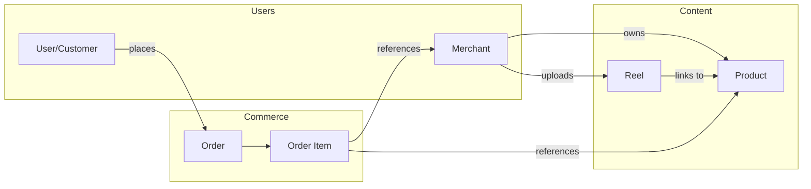

- **Reel path:** Merchant only → upload reel → link to own product (or external). No creator, no campaign.
- **Purchase path:** User browses (including reels), places order; order items reference product and merchant only. No attribution to any reel or creator.

---

## 3. Target State & Requirements

### 3.1 Roles (Target)

| Role | Description |
|------|-------------|
| **User/Customer** | Views reels, opens products, purchases. |
| **Merchant** | Lists products; **hires creators** (campaigns); approves reels; pays commission on attributed sales. |
| **Creator/Influencer** | **NEW.** Maintains portfolio & categories; accepts deals; uploads **campaign-linked** reels only. |
| **Admin / Super Admin** | Moderation, disputes, overrides (optional in V1). |

### 3.2 Creator Lifecycle (Target)

- **Signup / Login:** Same auth as today; new role value `creator`. No MerchantProfile; creator has a **CreatorProfile** (or equivalent).
- **Onboarding (mandatory):**
  - Select **at least 5 categories** in which they create reels.
  - Optional: language, portfolio links, sample reels.
  - **Availability:** Available / Busy.
- **Dashboard (V1):** Home (active deals, pending approvals, earnings, deadlines), My Categories, Portfolio, Deals/Campaigns (offers, active, completed), **Upload Reel** (only for assigned active campaigns), Earnings & Payouts, Settings.

### 3.3 Merchant Lifecycle (Target)

- **Creator Marketing section:** Find creators (filter by category, etc.), create campaign (offer), manage campaigns (approve reels, see attributed sales), payout/commission summary per creator.
- **Hire flow:** Select product → system suggests creators by **category match** + portfolio + availability → merchant selects creator and creates **Deal/Campaign** (product_id, creator_id, commission %, optional cap, campaign window, deliverable e.g. “1 reel”) → creator accepts → campaign becomes **Active**.

### 3.4 Campaign / Deal Lifecycle (Target)

- **Statuses (V1):** Draft → Sent → Accepted → Active → Submitted → Approved → Live → Completed.
- **Side states:** Rejected (creator rejects), Cancelled/Expired (merchant/admin or timeout).
- **Identification:** Internal `campaign_id`; short human-friendly `campaign_code` for display and optional lookup.

### 3.5 Reel Upload (Creator Path, Target)

- Creator can upload reels **only under assigned active campaigns**.
- Upload UI: **Select Campaign** (dropdown of active campaigns for that creator), upload video, description, submit.
- **Merchant approval:** Reel does not go to public feed until merchant approves (wrong product, quality, compliance).
- Backend: Reel record stores **campaign_id**; campaign already has product_id, merchant_id, creator_id. Chain: **Reel → Campaign → Product → Merchant + Creator**.

### 3.6 Attribution (Target)

- **Rule (V1):** **Last-touch attribution.** User sees reel → clicks to product → purchases. If purchase occurs **within X days** (e.g. 7) of the **last** reel→product click, that sale is attributed to the reel’s campaign (and thus creator).
- **Implementation:** Store **reel→product click events** (user, reel_id, product_id, campaign_id, timestamp). On order placement (or on delivery/eligibility), resolve last touch within window and set **attributed_campaign_id** (and hence creator) per order item or order.

### 3.7 Commission & Payout (Target)

- **Deal terms (V1):** (1) **Percent + cap** (e.g. 20% up to 200 qty), or (2) **Percent unlimited** (e.g. 10% on all attributed sales).
- **AOIN fee:** 5% on attributed sales (campaign-attributed only).
- **Commission base:** Net = item price − item discount − refunds; exclude shipping/tax.
- **Eligibility:** Order delivered + return/refund window passed (e.g. 7/14 days) → sale eligible for settlement.
- **Ledger:** Creator earning, AOIN fee, merchant net (informational). Payout: weekly/monthly or threshold-based. Refund/return → reversal/adjustment of creator payout and AOIN fee.

---

## 4. Gap Analysis

| Area | Current State | Target State | Gap |
|------|----------------|-------------|-----|
| **Roles** | USER, MERCHANT, ADMIN, SUPER_ADMIN | + CREATOR | Add `UserRole.CREATOR` and creator-specific profile/onboarding. |
| **Reels** | Merchant-only upload; no campaign | Creator upload for assigned campaigns; reel has `campaign_id` | New creator upload path; add `campaign_id` to reels; merchant approval workflow for creator reels. |
| **Campaign/Deal** | Does not exist | Full lifecycle (Draft→…→Completed); terms, code | New Campaign/Deal model and APIs (create, list, accept, reject, status). |
| **Creator profile** | Does not exist | Categories (≥5), portfolio, availability | New CreatorProfile (or equivalent) + onboarding APIs. |
| **Attribution** | None | Last-touch; reel→product click events | New attribution event model + click logging API + attribution resolution on order/delivery. |
| **Order/OrderItem** | No link to reel/campaign | Attributed sales per campaign/creator | Add attribution fields (e.g. `attributed_campaign_id`) and settlement logic. |
| **Settlement/Payout** | None | Ledger, eligibility, payouts, reversals | New ledger/earnings model + eligibility rules + payout flow (V1 can be manual or batch). |

---

## 5. Business Logic Flows & Diagrams

### 5.1 Role & Actor Overview

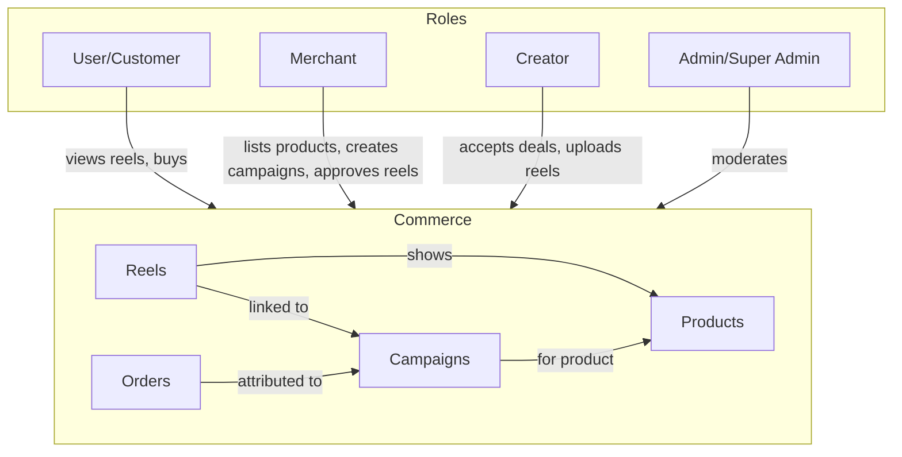

### 5.2 Campaign Lifecycle (State Machine)

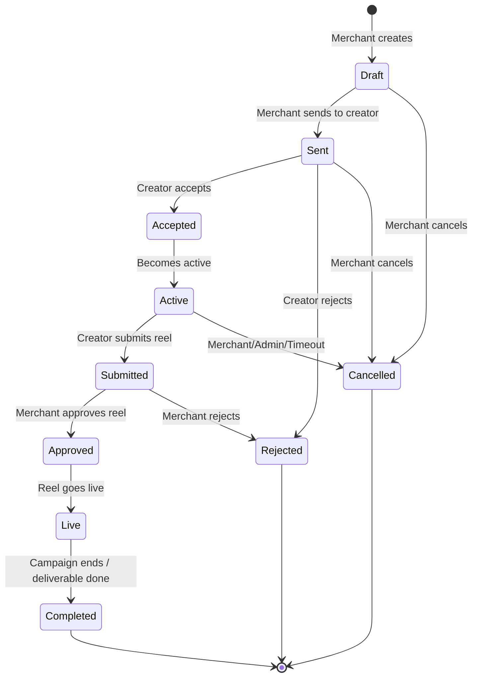

### 5.3 Merchant: Create Campaign & Creator Accepts

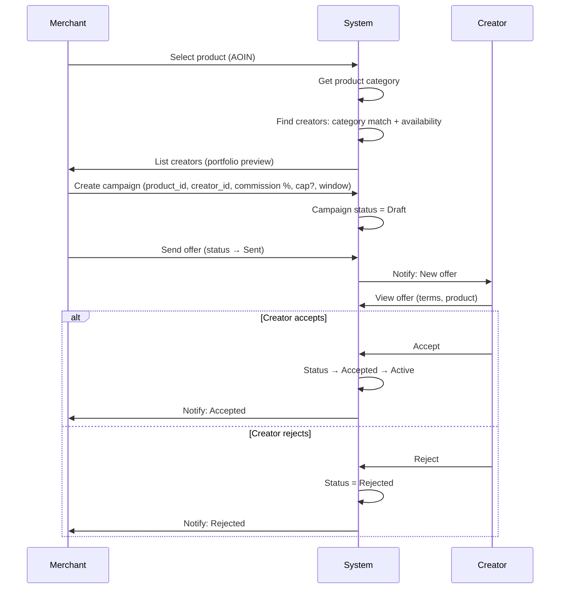

### 5.4 Creator: Upload Reel (Campaign-Linked)

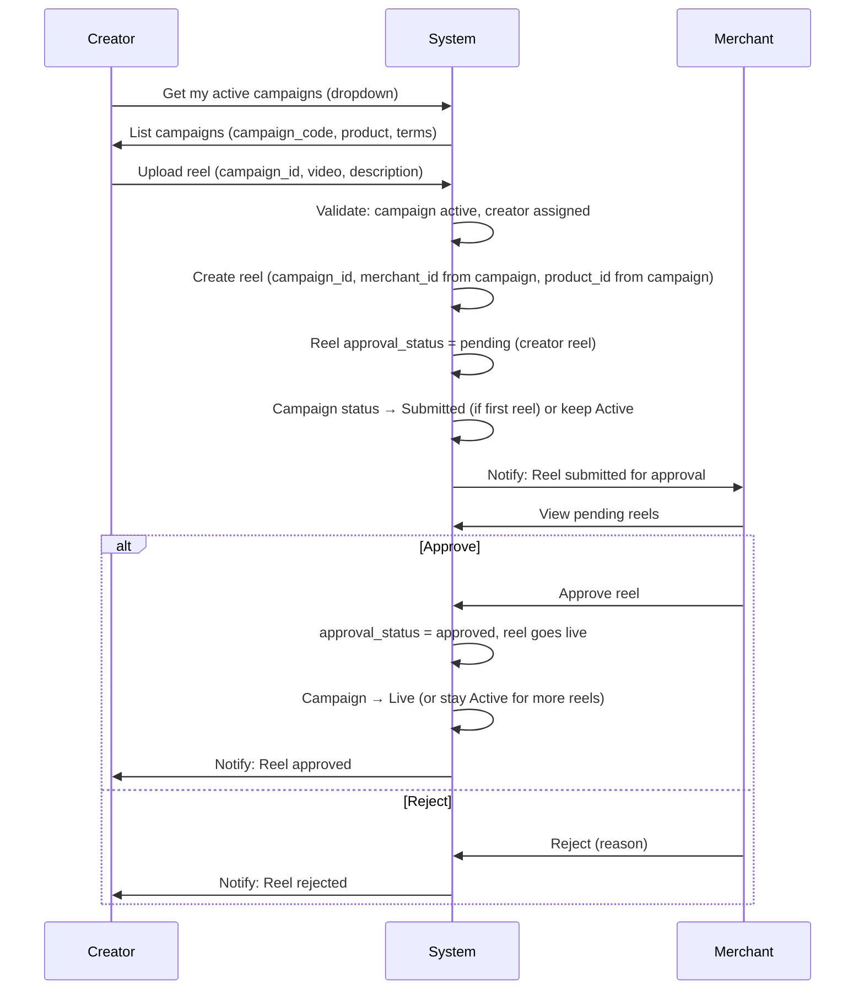

### 5.5 Attribution: Reel Click → Purchase → Settlement

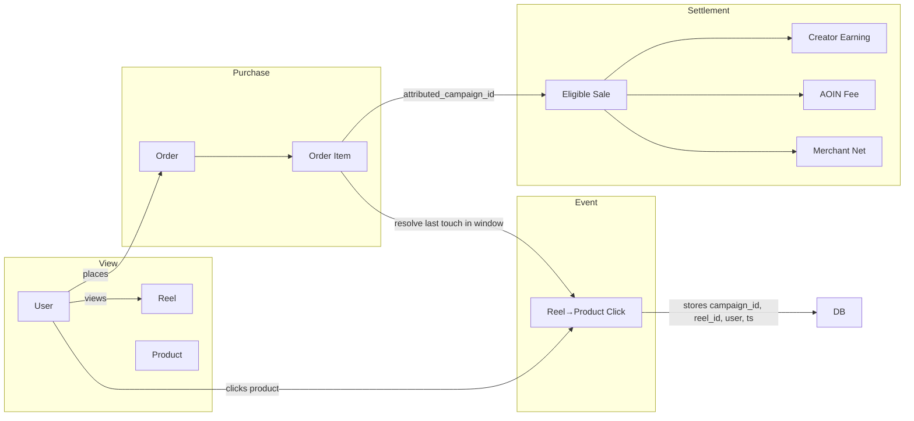

### 5.6 Last-Touch Attribution Rule (Conceptual)

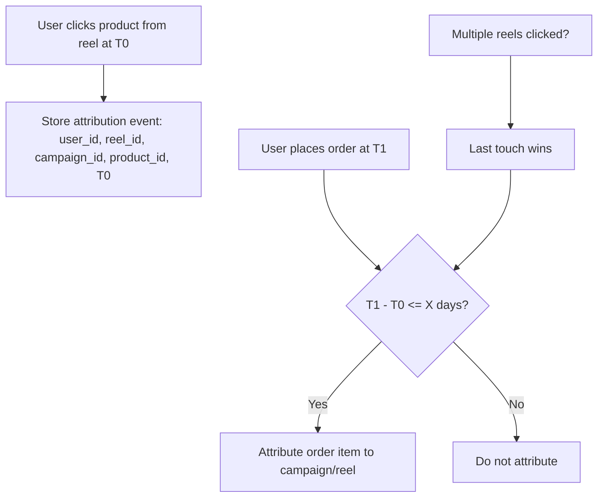

### 5.7 Settlement & Payout Flow (Conceptual)

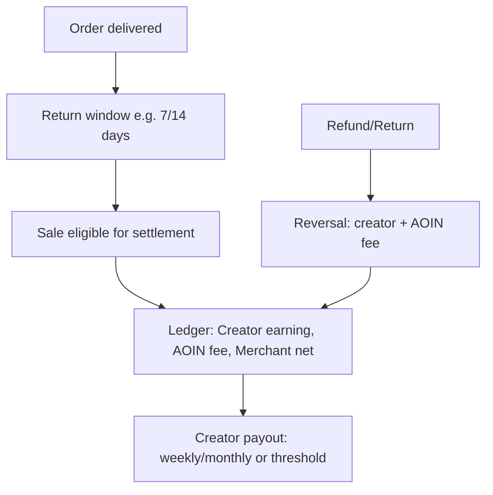

### 5.8 Current vs Target: Reel Ownership & Upload Paths

**Current (reels are merchant-only):**

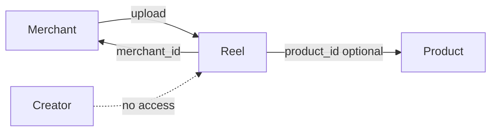

**Target (two paths: merchant direct + creator via campaign):**

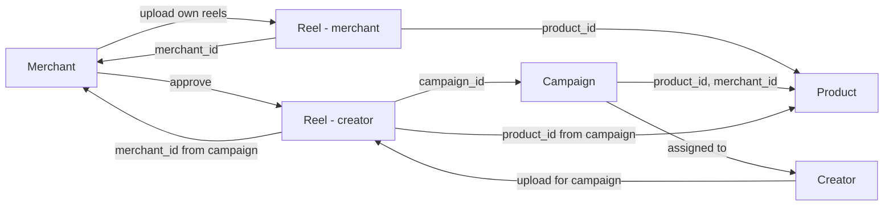

---

## 6. UI/UX Sections & Screen Maps

This section describes every possible UI section and screen for the Creator module, by role. Use these as a reference for wireframes, navigation, and UX flows.

### 6.1 Overall: Who Sees What (Role-Based Entry)

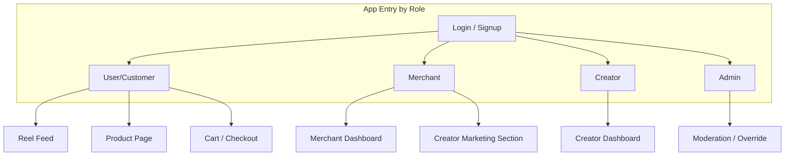

### 6.2 Creator Dashboard — Section Hierarchy

```mermaid
flowchart TB
    subgraph Creator_Dashboard["Creator Dashboard (post-login)"]
        Nav[Sidebar / Bottom Nav]
        Nav --> Home[Home / Overview]
        Nav --> Categories[My Categories]
        Nav --> Portfolio[Portfolio]
        Nav --> Deals[Deals / Campaigns]
        Nav --> Upload[Upload Reel]
        Nav --> Earnings[Earnings & Payouts]
        Nav --> Settings[Settings]
    end

    Home --> H1[Active deals count]
    Home --> H2[Pending approvals count]
    Home --> H3[Earnings summary]
    Home --> H4[Upcoming deadlines]

    Categories --> Cat1[Selected 5+ categories list]
    Categories --> Cat2[Edit categories - min 5]

    Portfolio --> P1[Portfolio items list]
    Portfolio --> P2[Links / showcase reels]
    Portfolio --> P3[Social handles]
    Portfolio --> P4[Add / Edit portfolio item]

    Deals --> D1[Offers received - Accept/Reject]
    Deals --> D2[Active campaigns - Submit reel, deadline]
    Deals --> D3[Completed campaigns - History]

    Upload --> U1[Select Campaign dropdown]
    Upload --> U2[Upload video]
    Upload --> U3[Add description]
    Upload --> U4[Submit for approval]

    Earnings --> E1[Pending earnings]
    Earnings --> E2[Eligible earnings]
    Earnings --> E3[Paid history]
    Earnings --> E4[Bank/UPI setup - when payout live]

    Settings --> S1[Profile edit]
    Settings --> S2[Availability toggle]
    Settings --> S3[Notification preferences]
```

### 6.3 Creator: Screen Flow (User Journey)

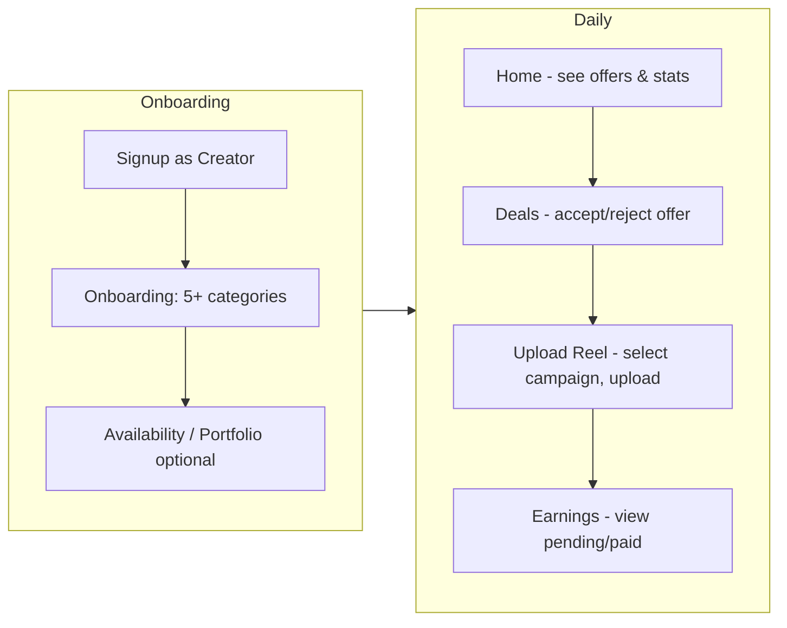

### 6.4 Merchant Dashboard — Creator Marketing Section

```mermaid
flowchart TB
    subgraph Merchant_Dashboard["Merchant Dashboard"]
        Main[Existing: Products, Orders, etc.]
        CreatorSection[Creator Marketing / Creator Campaigns]
        Main --> CreatorSection
    end

    subgraph Creator_Marketing["Creator Marketing Section"]
        Find[Find Creators]
        Create[Create Campaign]
        Manage[Manage Campaigns]
        PayoutSummary[Payout / Commission Summary]
    end

    Find --> F1[Filter by category]
    Find --> F2[Filter by availability]
    Find --> F3[Creator list with portfolio preview]
    Find --> F4[Select creator for offer]

    Create --> C1[Select product - AOIN product]
    Create --> C2[Select creator - from discovery]
    Create --> C3[Set terms: commission %, cap, window]
    Create --> C4[Deliverable: 1 reel - V1]
    Create --> C5[Send offer]

    Manage --> M1[Campaign list - status filter]
    Manage --> M2[View campaign detail - terms, creator]
    Manage --> M3[Pending reels - Approve / Reject]
    Manage --> M4[Track attributed sales per campaign]
    Manage --> M5[Cancel / Extend campaign]

    PayoutSummary --> PS1[Creator-wise commission]
    PayoutSummary --> PS2[Attributed sales total]
    PayoutSummary --> PS3[AOIN fee / Merchant net]
```

### 6.5 Merchant: Creator Campaign User Journey

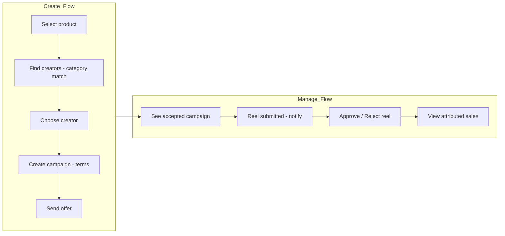

### 6.6 Customer / User: Reel & Product (Attribution UX)

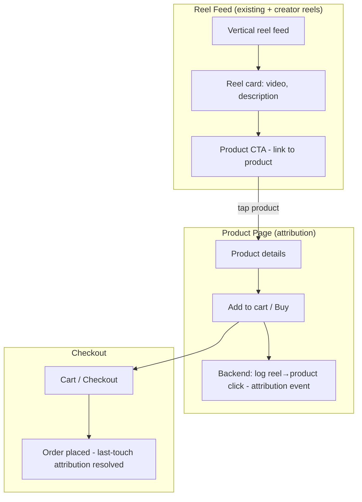

### 6.7 Creator Onboarding — Screen Breakdown

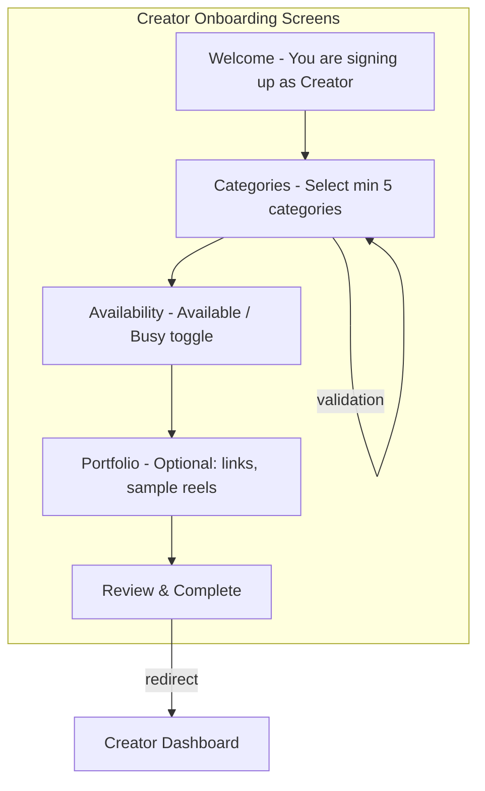

### 6.8 Campaign Lifecycle — UI States per Screen

```mermaid
stateDiagram-v2
    direction LR
    [*] --> Draft: Merchant: Create
    Draft --> Sent: Merchant: Send
    Sent --> OffersScreen: Creator: See offers
    OffersScreen --> Accepted: Creator: Accept
    OffersScreen --> Rejected: Creator: Reject
    Accepted --> ActiveScreen: Creator: Active campaigns
    ActiveScreen --> UploadScreen: Creator: Upload reel
    UploadScreen --> Submitted: Creator: Submit
    Submitted --> PendingApproval: Merchant: Pending reels
    PendingApproval --> Approved: Merchant: Approve
    PendingApproval --> RejectedReel: Merchant: Reject
    Approved --> Live: Reel live in feed
    Live --> Completed: Campaign end / deliverable done
```

### 6.9 Admin (Optional) — Moderation Section

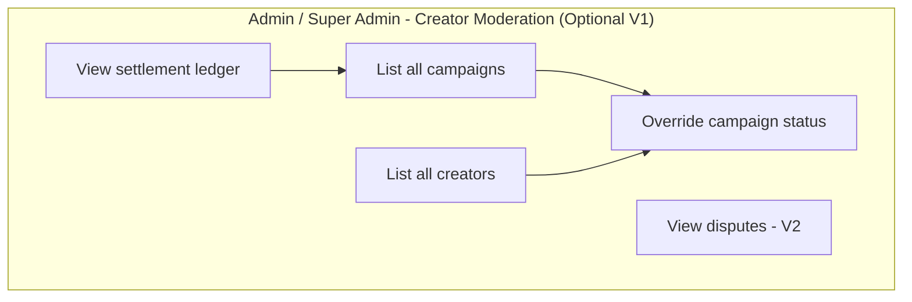

### 6.10 Summary: Full Section Map (All Roles)

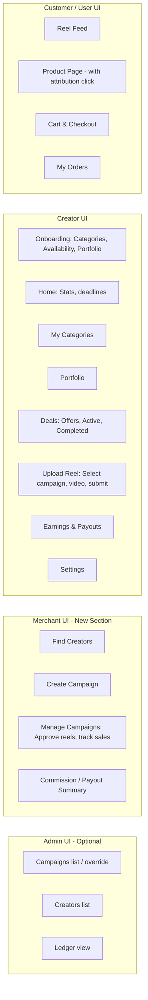

### 6.11 Navigation & Information Architecture (IA)

| Role    | Primary nav / Sections |
|---------|------------------------|
| **Creator** | Home, My Categories, Portfolio, Deals, Upload Reel, Earnings, Settings |
| **Merchant** | (Existing nav) + **Creator Marketing** → Find Creators, Create Campaign, Manage Campaigns, Payout Summary |
| **Customer** | (Existing) Reel feed, Product page, Cart, Orders — no new top-level section; attribution is invisible (backend click log). |
| **Admin** | (Optional) Campaigns, Creators, Ledger / Settlement |

---

## 7. Data Models

### 7.1 Current (Relevant) Models

**users**  
`id`, `email`, `password_hash`, `first_name`, `last_name`, `phone`, `role` (Enum: user, merchant, admin, super_admin), `is_active`, …

**merchant_profiles**  
`id`, `user_id` (FK users), `business_name`, `business_email`, … (no creator profile)

**reels**  
`reel_id`, `merchant_id` (FK), `product_id` (FK, nullable), `product_url`, `product_name`, `category_id`, `category_name`, `platform`, `video_url`, `description`, `approval_status`, `approved_by`, …

**products**  
`product_id`, `merchant_id`, `category_id`, `brand_id`, …

**categories**  
`category_id`, `parent_id`, `name`, `slug`, …

**orders**  
`order_id`, `user_id`, `order_status`, …

**order_items**  
`order_item_id`, `order_id`, `product_id`, `merchant_id`, quantity, prices, `item_status`, … (no attribution)

### 7.2 New / Modified Entities (V1)

**User (modify)**  
- Add to `UserRole` enum: `CREATOR = 'creator'`.

**creator_profiles (new)**  
- `id` (PK)  
- `user_id` (FK users, unique) — one creator profile per user  
- `availability` — e.g. ENUM or VARCHAR: `available`, `busy`  
- `language_preferences` — optional JSON or string  
- `portfolio_links` — optional JSON (array of URLs)  
- `created_at`, `updated_at`  

**creator_categories (new)**  
- `id` (PK)  
- `creator_id` (FK creator_profiles)  
- `category_id` (FK categories)  
- Unique (creator_id, category_id)  
- Ensures ≥5 categories per creator (enforced in application).

**campaigns (new)**  
- `campaign_id` (PK)  
- `campaign_code` (unique, short, human-friendly)  
- `merchant_id` (FK merchant_profiles)  
- `creator_id` (FK creator_profiles)  
- `product_id` (FK products)  
- `status` — ENUM: draft, sent, accepted, active, submitted, approved, live, completed, rejected, cancelled  
- `commission_type` — e.g. percent_capped, percent_unlimited  
- `commission_percent` — decimal  
- `commission_cap_quantity` — nullable int (cap units)  
- `campaign_window_start`, `campaign_window_end` — optional  
- `deliverable_type` — V1: e.g. "1_reel"  
- `created_at`, `updated_at`, `sent_at`, `accepted_at`, `completed_at`  

**reels (modify)**  
- Add `campaign_id` (FK campaigns, nullable). Null = merchant-uploaded (current behaviour); non-null = creator-uploaded, campaign-linked.  
- For creator reels: `merchant_id` and `product_id` can be derived from campaign; store for convenience/denormalization.  
- `approval_status`: for creator reels, support `pending` until merchant approves.

**attribution_events (new)**  
- `id` (PK)  
- `user_id` (FK users, nullable for guest)  
- `reel_id` (FK reels)  
- `campaign_id` (FK campaigns)  
- `product_id` (FK products)  
- `clicked_at` (datetime)  
- Optional: session_id, device_id for fraud later  

**order_items (modify)**  
- Add `attributed_campaign_id` (FK campaigns, nullable). Set when order is placed (or when item becomes eligible) using last-touch rule within attribution window.

**settlement_ledger (new)**  
- `id` (PK)  
- `order_item_id` (FK order_items)  
- `campaign_id` (FK)  
- `creator_id` (FK)  
- `merchant_id` (FK)  
- `eligible_amount` — net amount (item price − discount − refund) for commission base  
- `creator_commission_amount`  
- `platform_fee_amount` (5%)  
- `merchant_net_amount` (informational)  
- `status` — e.g. pending_payout, paid, reversed  
- `created_at`, `paid_at`  

**creator_payouts (new)**  
- `id` (PK)  
- `creator_id` (FK)  
- `amount`  
- `status` — e.g. pending, processing, completed, failed  
- `period_start`, `period_end`  
- `ledger_entry_ids` or link to ledger rows  
- `paid_at`, `reference` (bank/UPI ref later)  

(Exact table names and column types can follow backend conventions; the above is the logical shape.)

### 7.3 Entity-Relationship & Connectivity

The following diagram shows all Creator-module entities and their relationships. **Solid lines** are direct FKs; **dashed** indicates logical/derived linkage.

```mermaid
erDiagram
    USERS ||--o| MERCHANT_PROFILES : "has"
    USERS ||--o| CREATOR_PROFILES : "has"
    USERS ||--o{ ORDERS : "places"
    USERS ||--o{ ATTRIBUTION_EVENTS : "triggers"

    CREATOR_PROFILES ||--o{ CREATOR_CATEGORIES : "has"
    CREATOR_PROFILES ||--o{ CAMPAIGNS : "assigned_to"
    CREATOR_PROFILES ||--o{ CREATOR_PAYOUTS : "receives"

    CATEGORIES ||--o{ CREATOR_CATEGORIES : "in"
    CATEGORIES ||--o{ PRODUCTS : "contains"

    MERCHANT_PROFILES ||--o{ PRODUCTS : "owns"
    MERCHANT_PROFILES ||--o{ CAMPAIGNS : "creates"
    MERCHANT_PROFILES ||--o{ REELS : "owns_or_approves"

    CAMPAIGNS ||--o{ REELS : "linked_to"
    CAMPAIGNS }o--|| PRODUCTS : "for_product"
    CAMPAIGNS ||--o{ SETTLEMENT_LEDGER : "earns_from"
    CAMPAIGNS ||--o{ ATTRIBUTION_EVENTS : "attributed_via"

    PRODUCTS ||--o{ REELS : "featured_in"
    PRODUCTS ||--o{ ORDER_ITEMS : "sold_as"
    PRODUCTS }o--|| CATEGORIES : "belongs_to"

    REELS ||--o{ ATTRIBUTION_EVENTS : "click_from"

    ORDERS ||--o{ ORDER_ITEMS : "contains"
    ORDER_ITEMS }o--o| CAMPAIGNS : "attributed_to"
    ORDER_ITEMS ||--o{ SETTLEMENT_LEDGER : "settled_in"

    SETTLEMENT_LEDGER }o--o{ CREATOR_PAYOUTS : "included_in"

    USERS {
        int id PK
        string email
        string role "user, merchant, creator, admin"
    }

    CREATOR_PROFILES {
        int id PK
        int user_id FK,UK
        string availability
        json portfolio_links
    }

    CREATOR_CATEGORIES {
        int id PK
        int creator_id FK
        int category_id FK
    }

    CAMPAIGNS {
        int campaign_id PK
        string campaign_code UK
        int merchant_id FK
        int creator_id FK
        int product_id FK
        string status
        decimal commission_percent
        int commission_cap_quantity
    }

    REELS {
        int reel_id PK
        int merchant_id FK
        int product_id FK
        int campaign_id FK "nullable"
        string approval_status
    }

    ATTRIBUTION_EVENTS {
        int id PK
        int user_id FK
        int reel_id FK
        int campaign_id FK
        int product_id FK
        datetime clicked_at
    }

    ORDER_ITEMS {
        int order_item_id PK
        int order_id FK
        int product_id FK
        int merchant_id FK
        int attributed_campaign_id FK "nullable"
    }

    SETTLEMENT_LEDGER {
        int id PK
        int order_item_id FK
        int campaign_id FK
        int creator_id FK
        decimal creator_commission_amount
        decimal platform_fee_amount
        string status
    }

    CREATOR_PAYOUTS {
        int id PK
        int creator_id FK
        decimal amount
        string status
        datetime paid_at
    }
```

### 7.4 Table Connectivity Matrix

| From Table           | To Table           | Relationship        | FK Column(s)              |
|----------------------|--------------------|---------------------|---------------------------|
| creator_profiles     | users              | N:1                 | user_id                   |
| creator_categories   | creator_profiles   | N:1                 | creator_id                |
| creator_categories   | categories         | N:1                 | category_id               |
| campaigns            | merchant_profiles  | N:1                 | merchant_id               |
| campaigns            | creator_profiles  | N:1                 | creator_id                |
| campaigns            | products           | N:1                 | product_id                |
| reels                | campaigns          | N:1 (optional)     | campaign_id               |
| reels                | merchant_profiles  | N:1                 | merchant_id               |
| reels                | products           | N:1 (optional)      | product_id                |
| attribution_events   | users              | N:1 (optional)     | user_id                   |
| attribution_events   | reels              | N:1                 | reel_id                   |
| attribution_events   | campaigns          | N:1                 | campaign_id               |
| attribution_events   | products           | N:1                 | product_id                |
| order_items          | campaigns          | N:1 (optional)      | attributed_campaign_id   |
| settlement_ledger    | order_items        | N:1                 | order_item_id            |
| settlement_ledger    | campaigns          | N:1                 | campaign_id               |
| settlement_ledger    | creator_profiles   | N:1                 | creator_id               |
| creator_payouts      | creator_profiles  | N:1                 | creator_id               |

### 7.5 Data Flow Diagrams (DFD)

#### 7.5.1 DFD Level 0 — Context Diagram

Shows external entities and their high-level data flows with the system.

```mermaid
flowchart LR
    subgraph External["External Entities"]
        Creator[Creator]
        Merchant[Merchant]
        Customer[Customer]
        Admin[Admin]
    end

    subgraph System["AOIN Creator Module System"]
        SYS[(System)]
    end

    Creator -->|Profile, Categories, Availability| SYS
    Creator -->|Accept/Reject offers, Upload reels| SYS
    SYS -->|Offers, Active campaigns, Earnings| Creator

    Merchant -->|Create campaign, Approve reels| SYS
    SYS -->|Creator list, Campaign status, Settlement| Merchant

    Customer -->|View reels, Click product, Place order| SYS
    SYS -->|Reel feed, Product page| Customer

    Admin -->|Override, View ledger| SYS
    SYS -->|Campaigns, Ledger data| Admin
```

#### 7.5.2 DFD Level 1 — Main Processes & Data Stores

Shows major processes and their inputs/outputs and data stores.

```mermaid
flowchart TB
    subgraph External["External Entities"]
        Creator[Creator]
        Merchant[Merchant]
        Customer[Customer]
    end

    subgraph Processes["Processes"]
        P1[1. Creator Onboarding]
        P2[2. Campaign Management]
        P3[3. Reel Upload & Approval]
        P4[4. Attribution]
        P5[5. Settlement & Payout]
    end

    subgraph DataStores["Data Stores"]
        D1[(users)]
        D2[(creator_profiles)]
        D3[(creator_categories)]
        D4[(campaigns)]
        D5[(reels)]
        D6[(attribution_events)]
        D7[(orders / order_items)]
        D8[(settlement_ledger)]
        D9[(creator_payouts)]
    end

    Creator -->|Signup, Categories, Availability| P1
    P1 -->|Profile + categories| D2
    P1 -->|Links| D3
    D1 -->|user_id, role| P1

    Merchant -->|Create, Send, Cancel campaign| P2
    Creator -->|Accept, Reject offer| P2
    P2 -->|Campaign record| D4
    D4 -->|Status, terms| P2

    Creator -->|Upload reel - campaign_id, video| P3
    Merchant -->|Approve, Reject reel| P3
    P3 -->|Reel + campaign_id| D5
    D4 -->|Active campaigns| P3

    Customer -->|Click product from reel| P4
    P4 -->|Event: user, reel, campaign, product, ts| D6
    D5 -->|reel_id, campaign_id| P4
    Customer -->|Place order| P4
    P4 -->|attributed_campaign_id| D7

    D7 -->|Delivered, eligible items| P5
    P5 -->|Ledger rows| D8
    P5 -->|Payout records| D9
    D8 -->|Creator commission, AOIN fee| P5
    P5 -->|Paid amount| Creator
```

#### 7.5.3 DFD Level 2 — Attribution Process (Detail)

Detail of how attribution events are recorded and how order items get attributed.

```mermaid
flowchart LR
    subgraph Input["Inputs"]
        A[Customer clicks product from reel]
        B[Order placed]
    end

    subgraph AttributionProcess["Attribution Process"]
        P1[Record click event]
        P2[Store: user_id, reel_id, campaign_id, product_id, clicked_at]
        P3[On order: for each item find last touch in window]
        P4[Set order_item.attributed_campaign_id]
        P1 --> P2
        B --> P3
        P3 --> P4
    end

    subgraph Stores["Data Stores"]
        S1[(attribution_events)]
        S2[(order_items)]
        S3[(reels)]
        S4[(campaigns)]
    end

    A --> P1
    P1 --> P2 --> S1
    S3 -->|reel_id -> campaign_id| P2
    S4 -->|campaign_id| P2
    P3 --> S1
    S1 -->|last touch within X days| P3
    P4 --> S2
```

#### 7.5.4 DFD Level 2 — Settlement Process (Detail)

Detail of how eligible sales become ledger entries and payouts.

```mermaid
flowchart TB
    subgraph Input["Inputs"]
        I1[Order delivered]
        I2[Return window passed]
    end

    subgraph SettlementProcess["Settlement Process"]
        P1[Find order_items with attributed_campaign_id]
        P2[Check delivery + return window]
        P3[Compute net amount, creator %, AOIN 5%]
        P4[Create settlement_ledger row]
        P5[Block if buyer = creator or merchant]
        P6[Payout run: aggregate by creator, create creator_payout]
        P7[Mark ledger entries as paid]
        P1 --> P2 --> P5 --> P3 --> P4
        P4 --> P6 --> P7
    end

    subgraph Stores["Data Stores"]
        D1[(order_items)]
        D2[(orders / status)]
        D3[(settlement_ledger)]
        D4[(creator_payouts)]
        D5[(campaigns)]
    end

    I1 --> P2
    I2 --> P2
    D1 --> P1
    D2 --> P2
    D5 --> P3
    P4 --> D3
    P6 --> D4
    D3 --> P6
    P7 --> D3
```

#### 7.5.5 Database Data Flow Summary

| Flow | Source | Process | Destination / Store |
|------|--------|---------|----------------------|
| Creator profile | Creator | Onboarding | creator_profiles, creator_categories |
| Campaign offer | Merchant | Create / Send | campaigns |
| Accept / Reject | Creator | Campaign Management | campaigns.status |
| Reel upload | Creator | Upload (campaign-linked) | reels (campaign_id, approval_status) |
| Reel approve | Merchant | Approval | reels.approval_status |
| Reel→product click | Customer | Attribution record | attribution_events |
| Order placement | Customer | Last-touch resolve | order_items.attributed_campaign_id |
| Eligible sale | Order / Item | Settlement job | settlement_ledger |
| Payout | Ledger | Payout run | creator_payouts |

---

## 8. API Surface — Detailed Specification

This is the **most detailed API section** for the Creator module: it covers **every** endpoint with **expected request and response** (body/query/path params, success and error payloads). Use it as the single source of truth for integration and testing.

**Scope of this section:**
- **Every API** from auth (creator signup/login) through onboarding, profile, campaigns (merchant + creator), reel upload, merchant approval, attribution, earnings, settlement, and optional admin.
- **Per-endpoint detail:** Purpose, method, path, auth; path parameters (where applicable); query parameters (name, type, required, default); request body fields (name, type, required, description) and example JSON; response 200/201 with example JSON; response 400/401/403/404/409/413 with example error body.
- **Companion doc:** [CREATOR_MODULE_API_SPEC.md](./CREATOR_MODULE_API_SPEC.md) contains the same level of detail (request + response examples) for every endpoint in one place; Section 8 below shows the same format for 8.1 and the Quick Reference + Master Response Codes.

**Base URL:** e.g. `https://api.aoinstore.com`.  
**Auth:** All authenticated endpoints expect `Authorization: Bearer <JWT>` unless noted.

**Conventions:**  
- `id` in path = resource ID (e.g. `campaign_id`, `reel_id`).  
- Success responses use `200` or `201`; errors use `4xx`/`5xx` with a consistent `{ "error": "...", "code": "...", "details": {} }` shape where applicable.

### 8.0 Master response codes (by endpoint)

| Endpoint | 200 | 201 | 400 | 401 | 403 | 404 | 409 | 413 |
|----------|-----|-----|-----|-----|-----|-----|-----|-----|
| POST /api/auth/signup | | ✓ | ✓ | | | | | |
| POST /api/auth/login | ✓ | | ✓ | ✓ | | | | |
| POST /api/creator/onboarding | | ✓ | ✓ | ✓ | ✓ | | ✓ | |
| GET /api/creator/profile | ✓ | | | ✓ | ✓ | ✓ | | |
| PATCH /api/creator/profile | ✓ | | ✓ | ✓ | ✓ | ✓ | | |
| GET /api/categories | ✓ | | | | | | | |
| GET /api/campaigns/creators | ✓ | | | ✓ | ✓ | | | |
| POST /api/campaigns | | ✓ | ✓ | | ✓ | | | |
| POST /api/campaigns/:id/send | ✓ | | ✓ | ✓ | ✓ | ✓ | | |
| GET /api/campaigns | ✓ | | | ✓ | ✓ | | | |
| GET /api/campaigns/:id | ✓ | | | ✓ | ✓ | ✓ | | |
| PATCH /api/campaigns/:id | ✓ | | ✓ | ✓ | ✓ | ✓ | | |
| GET /api/creator/campaigns | ✓ | | | ✓ | ✓ | | | |
| GET /api/creator/campaigns/:id | ✓ | | | ✓ | ✓ | ✓ | | |
| POST /api/creator/campaigns/:id/accept | ✓ | | ✓ | ✓ | ✓ | ✓ | | |
| POST /api/creator/campaigns/:id/reject | ✓ | | | ✓ | ✓ | ✓ | | |
| GET /api/creator/campaigns/active | ✓ | | | ✓ | ✓ | | | |
| POST /api/creator/reels | | ✓ | ✓ | ✓ | ✓ | | | ✓ |
| GET /api/campaigns/:id/reels/pending | ✓ | | | ✓ | ✓ | ✓ | | |
| POST /api/reels/:id/approve | ✓ | | ✓ | ✓ | ✓ | ✓ | | |
| POST /api/reels/:id/reject | ✓ | | ✓ | ✓ | ✓ | ✓ | | |
| POST /api/attribution/click | | ✓ | ✓ | ✓ | | | | |
| GET /api/creator/earnings/summary | ✓ | | | ✓ | ✓ | | | |
| GET /api/creator/earnings | ✓ | | | ✓ | ✓ | | | |
| GET /api/creator/payouts/:id | ✓ | | | ✓ | ✓ | ✓ | | |
| GET /api/merchant/campaigns/:id/settlement | ✓ | | | ✓ | ✓ | ✓ | | |

---

### 8.1 Auth & Creator Signup

#### 8.1.1 Signup (with role creator)

**Purpose:** Register a new user with role `creator`. Same as existing signup; request body includes `role: "creator"`.

| Field | Type | Location | Required | Description |
|-------|------|----------|----------|-------------|
| email | string | body | Yes | Valid email. |
| password | string | body | Yes | Min length per policy. |
| first_name | string | body | Yes | |
| last_name | string | body | Yes | |
| phone | string | body | No | |
| role | string | body | Yes | Must be `"creator"` for creator signup. |

**Request (example):**
```json
{
  "email": "creator@example.com",
  "password": "SecurePass123",
  "first_name": "Jane",
  "last_name": "Creator",
  "phone": "+919876543210",
  "role": "creator"
}
```

**Response — 201 Created:**
```json
{
  "message": "User registered successfully",
  "user": {
    "id": 42,
    "email": "creator@example.com",
    "first_name": "Jane",
    "last_name": "Creator",
    "role": "creator",
    "is_email_verified": false
  },
  "access_token": "eyJ...",
  "refresh_token": "eyJ...",
  "expires_in": 3600
}
```

**Response — 400 Bad Request (e.g. validation):**
```json
{
  "error": "Validation failed",
  "code": "VALIDATION_ERROR",
  "details": { "field": "email", "message": "Email already registered" }
}
```

---

#### 8.1.2 Login (creator)

**Purpose:** Same as existing login. Response includes `role`; frontend redirects creators to Creator Dashboard.

**Request:** Existing login body (email/phone + password).

**Response — 200 OK:** Same as existing (tokens + user with `role: "creator"`).

---

### 8.2–8.11 Full request/response for every API

**For each and every endpoint** (onboarding, profile, discover creators, create/send/cancel campaign, list/get campaign, accept/reject, active campaigns, upload reel, pending reels, approve/reject reel, attribution click, earnings summary/list, payout detail, campaign settlement, admin APIs) **with expected request and response bodies**, see:

**[CREATOR_MODULE_API_SPEC.md](./CREATOR_MODULE_API_SPEC.md)**

That document lists all APIs in order with:
- Method, path, auth
- Request body/query parameters and example JSON
- Response 200/201 success body
- Response 400/404/409 (and 413 where applicable) error body

### 8.12 API Quick Reference Table

| # | Method | Path | Auth | Purpose |
|---|--------|------|------|---------|
| 8.1.1 | POST | `/api/auth/signup` | — | Signup with role creator |
| 8.1.2 | POST | `/api/auth/login` | — | Login (creator redirect) |
| 8.2.1 | POST | `/api/creator/onboarding` | Creator | Complete onboarding |
| 8.2.2 | GET | `/api/creator/profile` | Creator | Get profile + categories |
| 8.2.3 | PATCH | `/api/creator/profile` | Creator | Update profile |
| 8.2.4 | GET | `/api/categories` | Optional | List categories |
| 8.3.1 | GET | `/api/campaigns/creators` | Merchant | Discover creators |
| 8.3.2 | POST | `/api/campaigns` | Merchant | Create campaign (draft) |
| 8.3.3 | POST | `/api/campaigns/:id/send` | Merchant | Send offer |
| 8.3.4 | GET | `/api/campaigns` | Merchant | List my campaigns |
| 8.3.5 | GET | `/api/campaigns/:id` | Merchant | Get campaign detail |
| 8.3.6 | PATCH | `/api/campaigns/:id` | Merchant | Cancel / Extend |
| 8.4.1 | GET | `/api/creator/campaigns` | Creator | List my campaigns |
| 8.4.2 | GET | `/api/creator/campaigns/:id` | Creator | Get my campaign |
| 8.4.3 | POST | `/api/creator/campaigns/:id/accept` | Creator | Accept offer |
| 8.4.4 | POST | `/api/creator/campaigns/:id/reject` | Creator | Reject offer |
| 8.4.5 | GET | `/api/creator/campaigns/active` | Creator | Active campaigns (dropdown) |
| 8.5.1 | POST | `/api/creator/reels` | Creator | Upload reel (campaign-linked) |
| 8.6.1 | GET | `/api/campaigns/:id/reels/pending` | Merchant | Pending reels for campaign |
| 8.6.2 | POST | `/api/reels/:id/approve` | Merchant | Approve reel |
| 8.6.3 | POST | `/api/reels/:id/reject` | Merchant | Reject reel |
| 8.7.1 | POST | `/api/attribution/click` | User/guest | Record reel→product click |
| 8.8.1 | GET | `/api/creator/earnings/summary` | Creator | Earnings summary |
| 8.8.2 | GET | `/api/creator/earnings` | Creator | List earnings |
| 8.8.3 | GET | `/api/creator/payouts/:id` | Creator | Payout detail |
| 8.9.1 | GET | `/api/merchant/campaigns/:id/settlement` | Merchant | Campaign settlement |

---

**Legacy summary (pre-expansion):**

- **Auth:** Signup, login, JWT, role in token. No creator signup/onboarding.
- **Reels:**  
  - Upload (merchant only), list (public, merchant, by product), view, like, share, delete, etc.  
  - No campaign-scoped upload, no “my campaigns” or “pending approval”.
- **Products/Categories:** CRUD for merchants; public read. No “creators by category”.
- **Orders:** Create, list, status, shipments. No attribution or settlement APIs.

### 8.2 New / Modified APIs (V1)

**Auth & Creator onboarding**  
- Signup with `role=creator` (or convert to creator).  
- `POST /api/creator/onboarding` — set categories (≥5), availability, portfolio (optional).  
- `GET/PATCH /api/creator/profile` — get/update creator profile and categories.

**Campaigns (Merchant)**  
- `GET /api/campaigns/creators` — discover creators (filter by category, availability).  
- `POST /api/campaigns` — create campaign (product_id, creator_id, terms).  
- `POST /api/campaigns/:id/send` — send offer (Draft → Sent).  
- `GET /api/campaigns` — list merchant’s campaigns (filter by status).  
- `PATCH /api/campaigns/:id` — cancel, extend window, etc.  
- `GET /api/campaigns/:id` — campaign detail (terms, status, linked reels).

**Campaigns (Creator)**  
- `GET /api/creator/campaigns` — my offers (sent), active, completed.  
- `POST /api/creator/campaigns/:id/accept` — accept offer.  
- `POST /api/creator/campaigns/:id/reject` — reject offer.

**Reels (Creator path)**  
- `GET /api/creator/campaigns/active` — list active campaigns (for “Select Campaign” dropdown).  
- `POST /api/creator/reels` — upload reel (campaign_id, video, description). Validates campaign is active and assigned to creator; sets approval_status = pending.

**Reels (Merchant approval)**  
- `GET /api/campaigns/:id/reels/pending` — reels pending approval for this campaign.  
- `POST /api/reels/:id/approve` — approve reel (creator reel only).  
- `POST /api/reels/:id/reject` — reject with reason.

**Attribution**  
- `POST /api/attribution/click` — record reel→product click (user from JWT or session, reel_id, product_id; backend resolves campaign_id). Called by frontend when user taps product from reel.

**Settlement & Earnings**  
- `GET /api/creator/earnings` — pending, eligible, paid (summary and list).  
- `GET /api/merchant/campaigns/:id/settlement` — attributed sales, commission breakdown.  
- (Internal or admin) Process eligibility (e.g. cron after delivery + return window), create ledger rows, run payouts.

**Reels (read) — optional changes**  
- Include `campaign_id` and creator info in reel response where applicable; keep backward compatibility for merchant-only reels.

---

## 9. Implementation Phases & Deliverables

### Phase 1: Foundation (Roles & Creator Profile)

- Add `UserRole.CREATOR`.  
- Create `creator_profiles` and `creator_categories` tables; migrations.  
- Creator signup/onboarding API: set role, create profile, set ≥5 categories, availability.  
- `GET/PATCH /api/creator/profile`.  
- **Deliverable:** Creators can sign up and complete onboarding.

### Phase 2: Campaign / Deal Module

- Create `campaigns` table; migration.  
- Merchant: discover creators (by category, availability), create campaign, send offer.  
- Creator: list offers, accept/reject.  
- Status transitions (Draft → Sent → Accepted → Active; Rejected, Cancelled).  
- **Deliverable:** Merchants can create and send offers; creators can accept/reject; campaign_code generated.

### Phase 3: Creator Reel Upload & Merchant Approval

- Add `campaign_id` (nullable) to `reels`; migration.  
- Creator upload API: select campaign (active, assigned), upload video + description; create reel with campaign_id, approval_status = pending.  
- Merchant approval APIs: list pending reels for campaign, approve/reject.  
- Visibility: creator reels appear in feed only when approved.  
- **Deliverable:** Creators upload campaign-linked reels; merchants approve; reels go live after approval.

### Phase 4: Attribution

- Create `attribution_events` table; migration.  
- `POST /api/attribution/click` — store event (user, reel, product, campaign, timestamp).  
- On order placement (or when item is created): for each item, resolve last-touch within X days (e.g. 7); set `attributed_campaign_id` on order_item (or equivalent).  
- **Deliverable:** Reel→product clicks logged; orders/items linked to campaign for eligible purchases.

### Phase 5: Settlement & Payouts

- Add `attributed_campaign_id` (or equivalent) to order_items; create `settlement_ledger` and `creator_payouts`; migrations.  
- Eligibility job: after delivery + return window, create ledger entries (creator commission, AOIN fee, merchant net).  
- Block attribution if buyer user_id == creator or merchant (same user).  
- Creator earnings API: pending, eligible, paid.  
- Merchant campaign settlement API: attributed sales, commission summary.  
- Payout run (weekly/monthly or threshold): mark ledger as paid, create creator_payout record (V1 can be manual trigger).  
- Refund/return: reversal logic for creator and AOIN fee.  
- **Deliverable:** Commission and platform fee calculated; creator earnings visible; payouts runnable (manual or scheduled).

### Phase 6: Polish & Edge Cases

- Reel upload: one reel → one product (campaign enforces product).  
- Fraud: block attribution when buyer is creator or merchant.  
- Notifications: new offer, accepted, reel submitted, reel approved/rejected (optional).  
- Admin: list campaigns, override status, view ledger (optional).

---

## 10. Edge Cases & Business Rules

| Case | Rule |
|------|------|
| Creator categories | Minimum 5 categories mandatory at onboarding; edit allowed with same minimum. |
| Portfolio | Optional but recommended; no hard block. |
| Availability | Toggle Available/Busy; used in creator discovery. |
| Wrong reel / quality | Merchant can reject or request changes; reel not live until approved. |
| Self-order / fraud (V1) | Do not attribute if order’s user_id equals creator’s user_id or merchant’s user_id. |
| Multiple products in one reel | V1: one reel → one product (enforced by campaign). |
| Commission base | Net = item price − item discount − refunds; exclude shipping/tax. |
| AOIN fee | 5% on attributed sales only. |
| Attribution window | Configurable X days (e.g. 7); last-touch wins. |
| Eligibility | Order delivered + return/refund window passed (e.g. 7/14 days). |
| Refund/return | Reverse or adjust creator payout and AOIN fee for affected items. |

---

## 11. Glossary

| Term | Definition |
|------|------------|
| **Campaign** | A deal between merchant and creator for a specific product: commission terms, optional cap, window; deliverable (e.g. 1 reel). |
| **Campaign code** | Short, human-friendly identifier for a campaign (e.g. for dropdown or sharing). |
| **Creator** | User with role Creator; has creator profile (categories, portfolio, availability); accepts campaigns and uploads campaign-linked reels. |
| **Attribution** | Assigning a sale (order item) to a reel/campaign/creator when the user clicked from that reel to product within the attribution window (last-touch). |
| **Last-touch** | Attribution rule: the most recent reel→product click within X days before purchase gets credit. |
| **Eligible sale** | Order item that is delivered and past return/refund window, used for settlement. |
| **Settlement ledger** | Record of creator commission, AOIN fee, and merchant net per eligible attributed sale. |
| **Creator payout** | Payment to creator (batch or single) for earned commission (V1: manual or scheduled run). |

---

---

## 12. Architecture Gaps & Missing Specifications

*As a Software Architect, the following items are **missing or underspecified** in this PRD. They should be decided and documented before or during implementation to avoid rework and production issues.*

### 12.1 Non-Functional Requirements (NFRs)

| Gap | Description | Recommendation |
|-----|-------------|----------------|
| **Performance** | No latency or throughput targets. | Define: API p95 latency (e.g. &lt; 500ms for read, &lt; 2s for upload), attribution write throughput, reel upload max duration. |
| **Scalability** | No expected scale. | Define: max creators, campaigns per merchant, attribution events/day; plan for read-heavy (feed) vs write-heavy (clicks). |
| **Availability** | No SLA. | Define: target uptime for Creator APIs; dependency on order/delivery status for settlement. |
| **Rate limiting** | Not mentioned. | Define: per-user/per-role limits (e.g. attribution/click, campaign create, reel upload) to prevent abuse. |

### 12.2 Security & Authorization

| Gap | Description | Recommendation |
|-----|-------------|----------------|
| **RBAC matrix** | Who can call what is implied but not tabular. | Add: matrix (Creator / Merchant / Admin × resource × action); e.g. Creator can only PATCH own profile, only accept/reject campaigns assigned to them. |
| **Resource-level auth** | Campaign/reel ownership checks are implied. | Specify: merchant can only see/edit own campaigns; creator only campaigns where creator_id = self; admin override rules. |
| **PII & sensitive data** | Creator earnings, merchant settlement. | Define: who can see what; audit log for payout, approval, cancel; mask in logs. |
| **JWT / claims** | Role in token mentioned; scope not. | Define: token claims (role, creator_id/merchant_id when applicable); token refresh for long sessions. |

### 12.3 Configuration & Constants

| Gap | Description | Recommendation |
|-----|-------------|----------------|
| **Attribution window** | "X days (e.g. 7)" not bound. | Define: config key (e.g. `ATTRIBUTION_WINDOW_DAYS`), default 7, env or DB. |
| **AOIN fee %** | "5%" hardcoded in narrative. | Define: config key (e.g. `PLATFORM_FEE_PERCENT`), default 5. |
| **Eligibility return window** | "7/14 days" — source of truth? | Tie to existing order/shipment config; document which status + which window. |
| **campaign_code format** | "Short, human-friendly" only. | Define: format (e.g. `CAMP-{alnum}`), length, uniqueness, generation (timestamp + random?). |
| **Reel upload limits** | Max file size, formats. | Document: max size (e.g. 100MB), allowed types (mp4, webm, mov); align with existing reel upload. |

### 12.4 Integration & System Boundaries

| Gap | Description | Recommendation |
|-----|-------------|----------------|
| **When attribution is set** | "On order placement or when item becomes eligible" is ambiguous. | Decide: set `attributed_campaign_id` at **order placement** (synchronous) vs at **delivery/eligibility** (async job). Document and reflect in DFD/sequence. |
| **Order/delivery source** | Eligibility depends on "delivered" and "return window passed". | Document: which order/shipment statuses and fields drive eligibility; link to existing enums and workflows. |
| **Payout mechanism** | "Bank/UPI later" vague. | Specify: V1 manual transfer vs integrated payout (Razorpay, PayU, etc.); creator bank/UPI capture and validation (KYC if needed). |
| **Reel storage** | Creator reels same as merchant reels? | Confirm: same S3/Cloudinary bucket and path policy; any quota per creator/campaign. |
| **Notifications** | Optional; not specified. | Decide: in-app only vs email/push; events (new offer, accepted, reel submitted, approved/rejected); payload and channels. |

### 12.5 Data & Compliance

| Gap | Description | Recommendation |
|-----|-------------|----------------|
| **Retention** | attribution_events, ledger, payouts. | Define: retention (e.g. attribution_events 1 year, ledger 7 years); archival or purge policy. |
| **GDPR / deletion** | Creator deletes account. | Define: cascade (anonymize/delete profile, categories, campaigns as creator? reels? ledger?); legal hold for payouts. |
| **Currency** | Ledger and payouts. | Define: single currency (e.g. INR) or multi-currency; store currency per ledger row and payout. |
| **Data residency** | Not mentioned. | If required, state where creator/campaign/attribution data must reside. |

### 12.6 Concurrency & Consistency

| Gap | Description | Recommendation |
|-----|-------------|----------------|
| **Idempotency** | Accept/reject, create campaign, upload reel. | Define: idempotency key (header or body) for POST; behaviour on duplicate (return 200 + existing resource). |
| **Campaign state transitions** | State machine drawn; allowed transitions per role not tabular. | Add: matrix (current_status × action × role → new_status); reject invalid transitions with 409. |
| **Double accept** | Creator clicks Accept twice. | Idempotent by campaign_id + creator; return 200 with current state if already accepted. |
| **Optimistic locking** | Concurrent update to campaign/reel. | Consider version or updated_at check on PATCH to avoid lost updates. |
| **Attribution race** | Order placed same second as click. | Define: ordering (e.g. click before order timestamp); or accept both and use last touch. |

### 12.7 Attribution Details

| Gap | Description | Recommendation |
|-----|-------------|----------------|
| **Guest users** | user_id null; "session_id or device_id" optional. | Define: how guest last-touch is keyed (session_id, device_id, cookie); retention and matching at order. |
| **Multi-item order** | Each order_item can have different product. | Confirm: each order_item gets its own last-touch per product_id; document in attribution rule. |
| **Product mismatch** | User clicks product A from reel, adds product B (variant or wrong product). | Define: attribute by product_id match only; or by product + variant/category. |

### 12.8 Settlement & Payout

| Gap | Description | Recommendation |
|-----|-------------|----------------|
| **Eligibility job** | "After delivery + return window". | Specify: trigger (cron schedule vs event); idempotent (skip already-settled items); failure alert and retry. |
| **Payout run** | "Weekly/monthly or threshold". | Specify: schedule or threshold; who triggers (admin vs automated); output (CSV for bank, or API to payment provider). |
| **Partial refund** | One item in order refunded. | Define: proportional reversal of creator_commission and platform_fee for that item; ledger reversal entry. |
| **Creator onboarding for payout** | Bank/UPI capture. | Define: when required (before first payout?); validation; link to existing KYC if any. |

### 12.9 Data Model Gaps

| Gap | Description | Recommendation |
|-----|-------------|----------------|
| **reels.creator_id** | Reel uploaded by creator; ownership is merchant (campaign). | Decide: add optional `creator_id` on reels for "uploaded by" display and filtering; or always derive from campaign. |
| **Ledger/payout currency** | settlement_ledger, creator_payouts. | Add: currency column (e.g. INR); or document single-currency assumption. |
| **creator_payouts** | payment_method, beneficiary details. | Add: payment_method (bank/UPI), reference_id, beneficiary_id or mask; for audit and reconciliation. |
| **campaign_code uniqueness** | Unique per tenant/global? | Specify: global unique; format and collision handling. |

### 12.10 Observability

| Gap | Description | Recommendation |
|-----|-------------|----------------|
| **Logging** | What to log. | Define: structured logs; PII redaction (email, name in logs); audit events (campaign sent, accepted, reel approved, payout run). |
| **Metrics** | Not mentioned. | Define: counters (campaigns_created, reels_uploaded, attribution_events, payouts_completed); gauges (pending_reels, eligible_earnings); latency histograms per API. |
| **Tracing** | Cross-service. | If order/settlement are separate: add trace id propagation for attribution and eligibility. |
| **Alerting** | Not mentioned. | Define: alerts (eligibility job failure, payout run failure, spike in attribution or errors). |

### 12.11 Deployment & Rollout

| Gap | Description | Recommendation |
|-----|-------------|----------------|
| **Feature flag** | Roll out by segment. | Define: flag (e.g. creator_module_enabled, or per-merchant); default off until stable. |
| **Backward compatibility** | Existing reels without campaign_id. | Document: all existing reels remain; new fields nullable; feed and APIs handle both. |
| **Migration order** | DB and app. | Document: run reels migration (e.g. 006) before deploying creator APIs; order of new tables (creator_profiles → campaigns → attribution_events → settlement_ledger). |
| **API versioning** | /api/... vs /v1/... | Decide: prefix (e.g. /v1/creator/...) or same /api with backward-compatible changes. |

### 12.12 Testing

| Gap | Description | Recommendation |
|-----|-------------|----------------|
| **Test strategy** | Not mentioned. | Define: unit (services, state machine), integration (API + DB), e2e (create campaign → accept → upload → approve → order → settlement); contract tests for public APIs. |
| **Load / stress** | Not mentioned. | Define: target load for attribution click and reel upload; basic load test before launch. |

### 12.13 Role & Identity

| Gap | Description | Recommendation |
|-----|-------------|----------------|
| **Dual role** | Can one user be both merchant and creator? | State explicitly: V1 one user = one role (no dual); or allow and define behaviour (separate creator_profile and merchant_profile). |
| **Same email** | User signs up as creator then as merchant (or vice versa). | Define: same account two roles vs two accounts; login and dashboard routing by role. |

### 12.14 Campaign & Reel Lifecycle Edge Cases

| Gap | Description | Recommendation |
|-----|-------------|----------------|
| **Campaign window expired** | Window end passed; campaign still "active"? | Define: automatic transition to completed/expired when window_end &lt; now; creator cannot upload after window end. |
| **Reel submitted before window end, approved after** | Allowed? | Define: allow; approval can be after window; reel stays linked to campaign for attribution. |
| **Product deleted or out of stock** | Campaign references product. | Define: campaign remains; reel visibility follows existing product rules; no new attribution for that product. |
| **Creator deactivated** | User disabled or creator profile removed. | Define: existing campaigns/reels/ledger preserved; no new offers to that creator; payouts still processed. |

### 12.15 Documentation & Process

| Gap | Description | Recommendation |
|-----|-------------|----------------|
| **Changelog** | API and behaviour changes. | Maintain: API changelog (new fields, new endpoints, breaking changes) and link from PRD. |
| **Attribution resolution sequence** | Synchronous vs async. | Add: sequence diagram for "order placed → resolve last touch → set attributed_campaign_id" once decided. |
| **Ownership & approval** | PRD owner, review cycle. | Define: who owns PRD updates; review before each phase; version in Document History. |

---

## 13. Implementation Reference

This section provides **implementation-ready** artifacts: DDL, state machine table, RBAC matrix, config spec, error codes, sequence diagrams, test scenarios, and rollback/failure handling. Use it as the single reference during build.

---

### 13.1 DDL / Migration Snippets (MySQL)

Run in order. Replace `ecommerce_db` with your database name if different.

**13.1.1 Add CREATOR to UserRole (application enum)**  
In code: add `CREATOR = 'creator'` to `UserRole` enum in `auth/models/models.py`. No DB change if role is stored as string/VARCHAR.

**13.1.2 Create creator_profiles**

```sql
CREATE TABLE IF NOT EXISTS creator_profiles (
    id INT NOT NULL AUTO_INCREMENT,
    user_id INT NOT NULL,
    availability VARCHAR(20) NOT NULL DEFAULT 'available',
    language_preferences VARCHAR(100) NULL,
    portfolio_links JSON NULL,
    created_at DATETIME NOT NULL DEFAULT CURRENT_TIMESTAMP,
    updated_at DATETIME NOT NULL DEFAULT CURRENT_TIMESTAMP ON UPDATE CURRENT_TIMESTAMP,
    PRIMARY KEY (id),
    UNIQUE KEY uk_creator_profiles_user_id (user_id),
    CONSTRAINT fk_creator_profiles_user FOREIGN KEY (user_id) REFERENCES users(id) ON DELETE CASCADE
) ENGINE=InnoDB DEFAULT CHARSET=utf8mb4 COLLATE=utf8mb4_unicode_ci;
```

**13.1.3 Create creator_categories**

```sql
CREATE TABLE IF NOT EXISTS creator_categories (
    id INT NOT NULL AUTO_INCREMENT,
    creator_id INT NOT NULL,
    category_id INT NOT NULL,
    created_at DATETIME NOT NULL DEFAULT CURRENT_TIMESTAMP,
    PRIMARY KEY (id),
    UNIQUE KEY uk_creator_categories_creator_category (creator_id, category_id),
    CONSTRAINT fk_creator_categories_creator FOREIGN KEY (creator_id) REFERENCES creator_profiles(id) ON DELETE CASCADE,
    CONSTRAINT fk_creator_categories_category FOREIGN KEY (category_id) REFERENCES categories(category_id) ON DELETE CASCADE
) ENGINE=InnoDB DEFAULT CHARSET=utf8mb4 COLLATE=utf8mb4_unicode_ci;
```

**13.1.4 Create campaigns**

```sql
CREATE TABLE IF NOT EXISTS campaigns (
    campaign_id INT NOT NULL AUTO_INCREMENT,
    campaign_code VARCHAR(32) NOT NULL,
    merchant_id INT NOT NULL,
    creator_id INT NOT NULL,
    product_id INT NOT NULL,
    status VARCHAR(32) NOT NULL DEFAULT 'draft',
    commission_type VARCHAR(32) NOT NULL,
    commission_percent DECIMAL(5,2) NOT NULL,
    commission_cap_quantity INT NULL,
    campaign_window_start DATETIME NULL,
    campaign_window_end DATETIME NULL,
    deliverable_type VARCHAR(32) NOT NULL DEFAULT '1_reel',
    created_at DATETIME NOT NULL DEFAULT CURRENT_TIMESTAMP,
    updated_at DATETIME NOT NULL DEFAULT CURRENT_TIMESTAMP ON UPDATE CURRENT_TIMESTAMP,
    sent_at DATETIME NULL,
    accepted_at DATETIME NULL,
    completed_at DATETIME NULL,
    PRIMARY KEY (campaign_id),
    UNIQUE KEY uk_campaigns_code (campaign_code),
    KEY idx_campaigns_merchant (merchant_id),
    KEY idx_campaigns_creator (creator_id),
    KEY idx_campaigns_status (status),
    CONSTRAINT fk_campaigns_merchant FOREIGN KEY (merchant_id) REFERENCES merchant_profiles(id) ON DELETE CASCADE,
    CONSTRAINT fk_campaigns_creator FOREIGN KEY (creator_id) REFERENCES creator_profiles(id) ON DELETE CASCADE,
    CONSTRAINT fk_campaigns_product FOREIGN KEY (product_id) REFERENCES products(product_id) ON DELETE CASCADE
) ENGINE=InnoDB DEFAULT CHARSET=utf8mb4 COLLATE=utf8mb4_unicode_ci;
```

**13.1.5 Alter reels — add campaign_id and creator_id**  
*Prerequisite: migration 006 (product_id nullable, external columns) must be applied first.*

```sql
ALTER TABLE reels ADD COLUMN campaign_id INT NULL AFTER product_id;
ALTER TABLE reels ADD COLUMN creator_id INT NULL AFTER campaign_id;
ALTER TABLE reels ADD KEY idx_reels_campaign (campaign_id);
ALTER TABLE reels ADD KEY idx_reels_creator (creator_id);
-- Add FKs after campaigns table exists:
ALTER TABLE reels ADD CONSTRAINT fk_reels_campaign FOREIGN KEY (campaign_id) REFERENCES campaigns(campaign_id) ON DELETE SET NULL;
ALTER TABLE reels ADD CONSTRAINT fk_reels_creator FOREIGN KEY (creator_id) REFERENCES creator_profiles(id) ON DELETE SET NULL;
```

**13.1.6 Create attribution_events**

```sql
CREATE TABLE IF NOT EXISTS attribution_events (
    id BIGINT NOT NULL AUTO_INCREMENT,
    user_id INT NULL,
    reel_id INT NOT NULL,
    campaign_id INT NOT NULL,
    product_id INT NOT NULL,
    clicked_at DATETIME NOT NULL DEFAULT CURRENT_TIMESTAMP,
    session_id VARCHAR(255) NULL,
    PRIMARY KEY (id),
    KEY idx_attribution_user_clicked (user_id, product_id, clicked_at),
    KEY idx_attribution_campaign (campaign_id),
    CONSTRAINT fk_attribution_user FOREIGN KEY (user_id) REFERENCES users(id) ON DELETE SET NULL,
    CONSTRAINT fk_attribution_reel FOREIGN KEY (reel_id) REFERENCES reels(reel_id) ON DELETE CASCADE,
    CONSTRAINT fk_attribution_campaign FOREIGN KEY (campaign_id) REFERENCES campaigns(campaign_id) ON DELETE CASCADE,
    CONSTRAINT fk_attribution_product FOREIGN KEY (product_id) REFERENCES products(product_id) ON DELETE CASCADE
) ENGINE=InnoDB DEFAULT CHARSET=utf8mb4 COLLATE=utf8mb4_unicode_ci;
```

**13.1.7 Alter order_items — add attributed_campaign_id**

```sql
ALTER TABLE order_items ADD COLUMN attributed_campaign_id INT NULL AFTER merchant_id;
ALTER TABLE order_items ADD KEY idx_order_items_attributed_campaign (attributed_campaign_id);
ALTER TABLE order_items ADD CONSTRAINT fk_order_items_attributed_campaign FOREIGN KEY (attributed_campaign_id) REFERENCES campaigns(campaign_id) ON DELETE SET NULL;
```

**13.1.8 Create settlement_ledger**

```sql
CREATE TABLE IF NOT EXISTS settlement_ledger (
    id BIGINT NOT NULL AUTO_INCREMENT,
    order_item_id INT NOT NULL,
    campaign_id INT NOT NULL,
    creator_id INT NOT NULL,
    merchant_id INT NOT NULL,
    eligible_amount DECIMAL(12,2) NOT NULL,
    creator_commission_amount DECIMAL(12,2) NOT NULL,
    platform_fee_amount DECIMAL(12,2) NOT NULL,
    merchant_net_amount DECIMAL(12,2) NOT NULL,
    currency VARCHAR(3) NOT NULL DEFAULT 'INR',
    status VARCHAR(32) NOT NULL DEFAULT 'pending_payout',
    created_at DATETIME NOT NULL DEFAULT CURRENT_TIMESTAMP,
    paid_at DATETIME NULL,
    payout_id INT NULL,
    PRIMARY KEY (id),
    KEY idx_settlement_campaign (campaign_id),
    KEY idx_settlement_creator (creator_id),
    KEY idx_settlement_status (status),
    CONSTRAINT fk_settlement_order_item FOREIGN KEY (order_item_id) REFERENCES order_items(order_item_id) ON DELETE CASCADE,
    CONSTRAINT fk_settlement_campaign FOREIGN KEY (campaign_id) REFERENCES campaigns(campaign_id) ON DELETE CASCADE,
    CONSTRAINT fk_settlement_creator FOREIGN KEY (creator_id) REFERENCES creator_profiles(id) ON DELETE CASCADE,
    CONSTRAINT fk_settlement_merchant FOREIGN KEY (merchant_id) REFERENCES merchant_profiles(id) ON DELETE CASCADE
) ENGINE=InnoDB DEFAULT CHARSET=utf8mb4 COLLATE=utf8mb4_unicode_ci;
```

**13.1.9 Create creator_payouts**

```sql
CREATE TABLE IF NOT EXISTS creator_payouts (
    id INT NOT NULL AUTO_INCREMENT,
    creator_id INT NOT NULL,
    amount DECIMAL(12,2) NOT NULL,
    currency VARCHAR(3) NOT NULL DEFAULT 'INR',
    status VARCHAR(32) NOT NULL DEFAULT 'pending',
    period_start DATETIME NOT NULL,
    period_end DATETIME NOT NULL,
    payment_method VARCHAR(32) NULL,
    reference_id VARCHAR(100) NULL,
    paid_at DATETIME NULL,
    created_at DATETIME NOT NULL DEFAULT CURRENT_TIMESTAMP,
    PRIMARY KEY (id),
    KEY idx_creator_payouts_creator (creator_id),
    KEY idx_creator_payouts_status (status),
    CONSTRAINT fk_creator_payouts_creator FOREIGN KEY (creator_id) REFERENCES creator_profiles(id) ON DELETE CASCADE
) ENGINE=InnoDB DEFAULT CHARSET=utf8mb4 COLLATE=utf8mb4_unicode_ci;
```

**13.1.10 Add payout_id to settlement_ledger (if not in 13.1.8)**

```sql
ALTER TABLE settlement_ledger ADD CONSTRAINT fk_settlement_payout FOREIGN KEY (payout_id) REFERENCES creator_payouts(id) ON DELETE SET NULL;
```

**13.1.11 campaign_code generation**  
Generate unique code in application: e.g. `CAMP-` + uppercase alphanumeric (e.g. 6 chars from timestamp + random), check uniqueness and retry on collision.

---

### 13.2 Campaign State Machine — Transition Table

Allowed transitions: (current_status × action × role) → new_status. Any other combination returns **409 Conflict** with code `INVALID_STATE`.

| Current status | Action | Role | New status |
|----------------|--------|------|------------|
| draft | send | merchant | sent |
| draft | cancel | merchant | cancelled |
| sent | accept | creator | active |
| sent | reject | creator | rejected |
| sent | cancel | merchant | cancelled |
| active | cancel | merchant | cancelled |
| active | cancel | admin | cancelled |
| active | (creator submits reel) | creator | submitted * |
| submitted | approve_reel | merchant | live * |
| submitted | reject_reel | merchant | active |
| live | mark_complete | merchant / system | completed |
| — | expire (window_end &lt; now) | system | completed |

\* Optional: keep campaign status `active` and only reel approval_status changes; or move campaign to `submitted` when first reel submitted and to `live` when first reel approved. Document choice in implementation.

---

### 13.3 RBAC Matrix (Role × Resource × Action)

| Resource | Action | Creator | Merchant | Admin |
|----------|--------|---------|----------|-------|
| own profile | create (onboarding) | ✓ | — | — |
| own profile | read, update | ✓ | — | ✓ (view) |
| creator_categories | read, update (own) | ✓ | — | ✓ |
| creators (discovery) | list | — | ✓ | ✓ |
| campaigns | create (draft) | — | ✓ (own) | — |
| campaigns | send, cancel, extend | — | ✓ (own) | ✓ (override) |
| campaigns | list | — | ✓ (own) | ✓ (all) |
| campaigns | get by id | — | ✓ (own) | ✓ (all) |
| campaigns (assigned to me) | list, get, accept, reject | ✓ | — | — |
| campaigns (assigned to me) | list active (for upload) | ✓ | — | — |
| reels (creator upload) | create (campaign-linked) | ✓ | — | — |
| reels (pending for my campaign) | list, approve, reject | — | ✓ (own campaign) | ✓ |
| reels | read (feed, public) | ✓ | ✓ | ✓ |
| attribution_events | create (click) | — | — | — |
| attribution (click API) | call | user/guest | — | — |
| creator earnings | read own | ✓ | — | ✓ |
| merchant settlement | read (per campaign) | — | ✓ (own) | ✓ (all) |
| settlement ledger | read / run jobs | — | — | ✓ |
| creator payouts | read own | ✓ | — | ✓ |
| creator payouts | trigger run | — | — | ✓ |

**Resource-level rule:** Creator can only access campaigns where `creator_id` = current user’s creator_profile.id. Merchant can only access campaigns where `merchant_id` = current user’s merchant_profile.id.

---

### 13.4 Configuration Specification

| Key | Type | Default | Description | Used in |
|-----|------|---------|-------------|--------|
| ATTRIBUTION_WINDOW_DAYS | int | 7 | Days within which last reel→product click attributes sale. | Attribution resolution |
| PLATFORM_FEE_PERCENT | decimal | 5 | AOIN fee % on attributed sales. | Settlement |
| ELIGIBILITY_RETURN_DAYS | int | 14 | Days after delivery after which item is eligible (align with order policy). | Eligibility job |
| CAMPAIGN_CODE_PREFIX | string | CAMP- | Prefix for campaign_code. | Campaign create |
| CAMPAIGN_CODE_LENGTH | int | 6 | Alphanumeric length after prefix. | Campaign create |
| REEL_VIDEO_MAX_SIZE_MB | int | 100 | Max upload size in MB. | Reel upload |
| REEL_VIDEO_ALLOWED_EXTENSIONS | list | mp4, webm, mov | Allowed video extensions. | Reel upload |
| CREATOR_MODULE_ENABLED | bool | true | Feature flag for creator module. | All creator/merchant creator APIs |
| PAYOUT_CURRENCY | string | INR | Default currency for ledger and payouts. | Settlement, creator_payouts |

---

### 13.5 Error Codes Reference

| Code | HTTP | Description | When |
|------|------|-------------|------|
| VALIDATION_ERROR | 400 | Request body/query invalid. | Missing/invalid fields, min 5 categories, etc. |
| INVALID_STATE | 400 | State transition not allowed. | e.g. Send from non-draft, Accept from non-sent. |
| UNAUTHORIZED | 401 | Missing or invalid token. | No JWT or expired. |
| FORBIDDEN | 403 | Valid token but role/resource not allowed. | Merchant calling creator API, wrong campaign owner. |
| NOT_FOUND | 404 | Resource not found or not accessible. | Campaign/reel/profile not found or not owned. |
| CONFLICT | 409 | Conflict with current state (e.g. already exists). | Onboarding already done, duplicate accept. |
| PAYLOAD_TOO_LARGE | 413 | Request entity too large. | Reel video exceeds max size. |
| INTERNAL_ERROR | 500 | Unexpected server error. | Log and return generic message. |

All error responses: `{ "error": "<message>", "code": "<CODE>", "details": { ... } }`.

---

### 13.6 Sequence Diagrams (Key Flows)

**13.6.1 Attribution resolution (synchronous at order placement)**

```mermaid
sequenceDiagram
    participant Client
    participant OrderAPI
    participant AttributionSvc
    participant DB

    Client->>OrderAPI: POST /orders (create order)
    OrderAPI->>OrderAPI: Create order + order_items (product_id, quantity, ...)
    loop For each order_item
        OrderAPI->>AttributionSvc: resolve_last_touch(user_id, product_id, order_date)
        AttributionSvc->>DB: SELECT from attribution_events WHERE user_id, product_id, clicked_at >= order_date - X days ORDER BY clicked_at DESC LIMIT 1
        DB-->>AttributionSvc: event (campaign_id) or null
        AttributionSvc-->>OrderAPI: campaign_id or null
        OrderAPI->>OrderAPI: Set order_item.attributed_campaign_id
    end
    OrderAPI->>DB: Commit order + items
    OrderAPI-->>Client: 201 Order created
```

**13.6.2 Eligibility job (async)**

```mermaid
sequenceDiagram
    participant Cron
    participant EligibilityJob
    participant DB

    Cron->>EligibilityJob: Run (e.g. daily)
    EligibilityJob->>DB: Find order_items with attributed_campaign_id, order delivered, delivery_date + ELIGIBILITY_RETURN_DAYS < now, not yet in settlement_ledger
    DB-->>EligibilityJob: List of order_item_ids
    loop For each item
        EligibilityJob->>EligibilityJob: Compute net, creator %, platform fee; skip if buyer = creator/merchant
        EligibilityJob->>DB: INSERT settlement_ledger
    end
    EligibilityJob-->>Cron: Done (log success/failure count)
```

**13.6.3 Payout run (async)**

```mermaid
sequenceDiagram
    participant Admin
    participant PayoutJob
    participant DB
    participant Bank

    Admin->>PayoutJob: Trigger (e.g. POST /api/admin/settlement/run-payout)
    PayoutJob->>DB: SELECT creator_id, SUM(creator_commission_amount) FROM settlement_ledger WHERE status = 'pending_payout' GROUP BY creator_id
    DB-->>PayoutJob: Per-creator totals
    loop For each creator
        PayoutJob->>DB: INSERT creator_payouts (pending)
        PayoutJob->>Bank: Initiate transfer (or export CSV)
        alt Success
            PayoutJob->>DB: UPDATE settlement_ledger SET status='paid', paid_at, payout_id
            PayoutJob->>DB: UPDATE creator_payouts SET status='completed', paid_at, reference_id
        else Failure
            PayoutJob->>DB: UPDATE creator_payouts SET status='failed'
        end
    end
    PayoutJob-->>Admin: Summary (count, total amount, failures)
```

---

### 13.7 Test Scenarios (Key Flows)

| # | Scenario | Steps | Expected |
|---|----------|--------|----------|
| T1 | Creator signup and onboarding | 1) POST signup role=creator 2) POST onboarding (5 categories, availability) | 201 both; profile and categories created. |
| T2 | Merchant creates and sends campaign | 1) GET creators (filter category) 2) POST campaigns (draft) 3) POST campaigns/:id/send | 200 list; 201 campaign; 200 sent; status=sent. |
| T3 | Creator accepts campaign | 1) GET creator/campaigns (status=sent) 2) POST creator/campaigns/:id/accept | 200 list; 200 accept; status=active. |
| T4 | Creator uploads reel | 1) GET creator/campaigns/active 2) POST creator/reels (campaign_id, video, description) | 200 list; 201 reel; approval_status=pending. |
| T5 | Merchant approves reel | 1) GET campaigns/:id/reels/pending 2) POST reels/:id/approve | 200 list; 200 approve; reel visible in feed. |
| T6 | Attribution and order | 1) POST attribution/click (reel_id, product_id) as user 2) POST orders (cart with that product) | 201 click; 201 order; order_item.attributed_campaign_id set. |
| T7 | Eligibility and ledger | 1) Set order to delivered; advance delivery date + 14 days 2) Run eligibility job | settlement_ledger rows created for attributed items; status=pending_payout. |
| T8 | Self-order no attribution | 1) Creator clicks product from own reel 2) Creator places order | attribution event stored; at order placement attributed_campaign_id NOT set (buyer=creator). |
| T9 | Invalid state rejected | POST campaigns/:id/send twice; POST creator/campaigns/:id/accept for already accepted campaign | 400/409 second call; status unchanged. |
| T10 | RBAC: creator cannot see other creator campaigns | GET creator/campaigns with campaign for another creator | 404 or empty for that id. |

---

### 13.8 Rollback & Failure Handling

| Situation | Action | Rollback / Mitigation |
|-----------|--------|----------------------|
| **Migration fails mid-way** | Stop; fix script or data; re-run from last successful step. | Do not run application with partial schema; add FKs only after referenced tables exist. |
| **Deploy new code without migration** | New code expects new columns/tables. | Deploy migrations first, then app; or feature-flag new paths until migration run. |
| **Eligibility job fails** | Log error; alert; retry with backoff. | Job idempotent (skip already-settled items); safe to re-run. |
| **Payout run fails for one creator** | Mark that payout as failed; continue others; alert. | Retry single creator later; do not double-pay (payout record created with status=failed). |
| **Attribution write fails** | Return 500 to client; client may retry. | Optionally accept idempotent by (user, reel, product, time bucket) to dedupe. |
| **Reel upload fails after S3 write** | Orphan object in S3. | Periodic cleanup job for unreferenced keys; or rollback S3 delete on DB failure. |
| **Campaign state inconsistent** | Admin override via PATCH admin/campaigns/:id. | Document allowed overrides; audit log. |
| **Data fix required** | Prefer script with transaction; backup first. | Restore from backup if script wrong; run fix in transaction. |

---

### 13.9 API Changelog (Placeholder)

| Version | Date | Change |
|---------|------|--------|
| v1 | 2026-02-24 | Initial Creator module APIs per [CREATOR_MODULE_API_SPEC.md](./CREATOR_MODULE_API_SPEC.md). |

*When adding or changing APIs, document here: new endpoints, new request/response fields, breaking changes, deprecations.*

---

## Document History & References

| Version | Date | Change |
|---------|------|--------|
| 1.0 | 2026-02-24 | Initial PRD: current state analysis, target state, gaps, flows, data models, APIs, phases. |
| 1.1 | 2026-02-24 | Added Section 6: UI/UX Sections & Screen Maps (diagrams for Creator, Merchant, Customer, Admin). Renumbered Sections 7–11. |
| 1.2 | 2026-02-24 | Added Section 7.3–7.5: Entity-Relationship diagram, Table Connectivity Matrix, and DFDs (Level 0 context, Level 1 processes, Level 2 attribution & settlement). |
| 1.3 | 2026-02-24 | Expanded Section 8: detailed API spec with expected request/response for 8.1 (signup, login); added **CREATOR_MODULE_API_SPEC.md** with every Creator module API and full req/res; added API Quick Reference Table. |
| 1.4 | 2026-02-24 | Added **Section 12: Architecture Gaps & Missing Specifications** — Software Architect review: NFRs, security/RBAC, configuration, integration, data/compliance, concurrency, attribution details, settlement/payout, data model gaps, observability, deployment, testing, role/identity, lifecycle edge cases, documentation. |
| 1.5 | 2026-02-24 | Added **Section 13: Implementation Reference** — DDL/migration snippets (MySQL) for all new/changed tables; Campaign state machine transition table; RBAC matrix (Role × Resource × Action); Configuration specification (keys, type, default); Error codes reference; Sequence diagrams (attribution resolution, eligibility job, payout run); Test scenarios (T1–T10); Rollback & failure handling. |

**References:**

- [CREATOR_INFLUENCER_MODULE_HINGLISH_OVERVIEW.md](./CREATOR_INFLUENCER_MODULE_HINGLISH_OVERVIEW.md) — Source requirements (Hinglish).
- Codebase: `auth/models/models.py` (User, UserRole, MerchantProfile), `models/reel.py`, `controllers/reels_controller.py`, `models/order.py`, `models/shipment.py`, `models/enums.py`, `models/visit_tracking.py`.

---

*End of PRD. For implementation, use this document together with the existing Hinglish overview and current codebase.*
